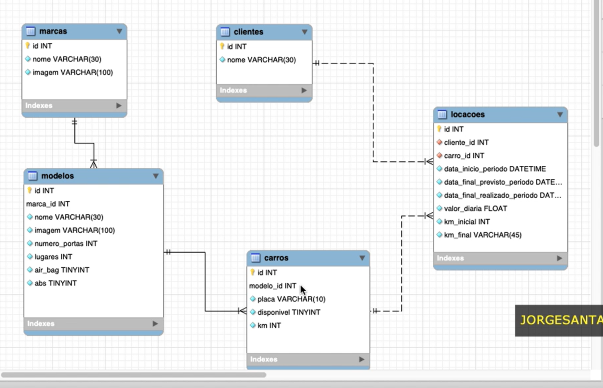

# Sobre a api 
##UML do Relacionamento:
  

## Filtros
As rotas suportam filtros utilizando o sinal ? após elas. Os parâmetros aceitos são: 

- search: para escolher quais colunas retornar. Ex: http:localhost:8080/api/brand_car?search=id,name 

- relationship: para escolher as colunas do relacionamento a serem retornadas desta tabela. Ex: http:localhost:8080/api/brand_car?relationship=name,id

- filter: para utilizar o where do sql. Ex: http:localhost:8080/api/brand_car?filter=name_=_ford(esse espera o atributo, o operador e o valor tudo entre underlines)

-Também é possivel utilizar os filtros acima juntos. Ex: http:localhost:8080/api/brand_car?search=id,name&relationship=id,name&filter=name_like_Ki%

